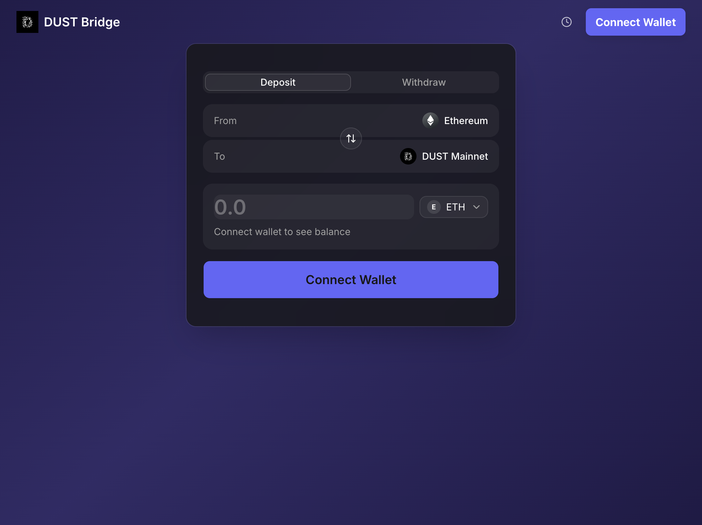

# OP Stack Bridge UI

An open-source, self-hostable bridge UI for OP Stack rollups. Supports deposits (L1→L2) and the full 3-step withdrawal flow (initiate → prove → finalize).

Built as an alternative to paid bridge-as-a-service solutions.



## Features

- **Single config file** — edit `src/config/bridge.config.ts` and deploy
- **Full withdrawal lifecycle** — initiate, prove (after ~1hr), finalize (after 7-day challenge period)
- **Transaction persistence** — localStorage tracks pending withdrawals so users can return to prove/finalize
- **Block explorer recovery** — recovers transaction history from Blockscout APIs if localStorage is cleared, including receipt reconstruction for in-flight withdrawals
- **ERC-20 support** — bridge any token pair with automatic approval flow
- **Wallet connection** — RainbowKit with MetaMask, Coinbase Wallet, WalletConnect, and more
- **Dark theme** — Superbridge-inspired card-based design with gradient background
- **Mobile responsive**

## Tech Stack

- Next.js 14+ (App Router)
- Tailwind CSS + shadcn/ui
- RainbowKit + wagmi v2
- viem with OP Stack extensions
- Zustand (transaction persistence)
- TanStack Query

## Quick Start

```bash
git clone <your-repo-url>
cd op-stack-bridge-ui
pnpm install
```

### 1. Configure your chain

Edit `src/config/bridge.config.ts` with your chain's details:

- L1/L2 chain info (chainId, RPC URL, block explorer, optional explorer API URL)
- Contract addresses from your op-deployer output:
  - `OptimismPortalProxy`
  - `L1StandardBridgeProxy`
  - `L1CrossDomainMessengerProxy`
  - `DisputeGameFactoryProxy`
- Supported tokens (ETH is included by default)
- Branding (app name, logo, theme colors)

### 2. Set WalletConnect Project ID

Create a `.env.local` file:

```
NEXT_PUBLIC_WALLETCONNECT_PROJECT_ID=your_project_id
```

Get a free project ID at [dashboard.walletconnect.com](https://dashboard.walletconnect.com/).

### 3. Run

```bash
pnpm dev
```

## Bridge Flows

### Deposit (L1 → L2)

1. Connect wallet on L1
2. Select token and enter amount
3. Review and confirm transaction
4. Funds arrive on L2 in ~3-10 minutes

### Withdrawal (L2 → L1)

1. Connect wallet on L2
2. Select token and enter amount
3. Confirm withdrawal initiation
4. **Wait ~1 hour** for the output root to be published
5. Return and click **Prove** (L1 transaction)
6. **Wait ~7 days** for the challenge period
7. Return and click **Finalize** (L1 transaction)

## Transaction Recovery

If a user clears their browser data, in-flight withdrawals can be recovered automatically. Set the optional `explorerApiUrl` fields in your bridge config to enable this:

```ts
l1: {
  // ...
  explorerApiUrl: "https://eth.blockscout.com/api",
},
l2: {
  // ...
  explorerApiUrl: "https://explorer.yourchain.com/api",
},
```

The app will query the Blockscout APIs to discover past deposits and withdrawals, reconstruct missing transaction receipts from the L2 RPC, and merge them with any localStorage data. This allows users to prove and finalize withdrawals even from a new browser or device.

Works with any Blockscout-compatible explorer API. If not configured, the app works as before (localStorage only).

## Compatibility

- **op-contracts**: v5.0.0+ (fault proofs via DisputeGameFactory)
- **op-deployer**: v0.5.2+
- Also supports older chains with L2OutputOracle (set `L2OutputOracleProxy` in config)

## Deployment

```bash
pnpm build
```

Deploy the `.next` output to Vercel, Cloudflare Pages, or any Node.js host.

## License

MIT
